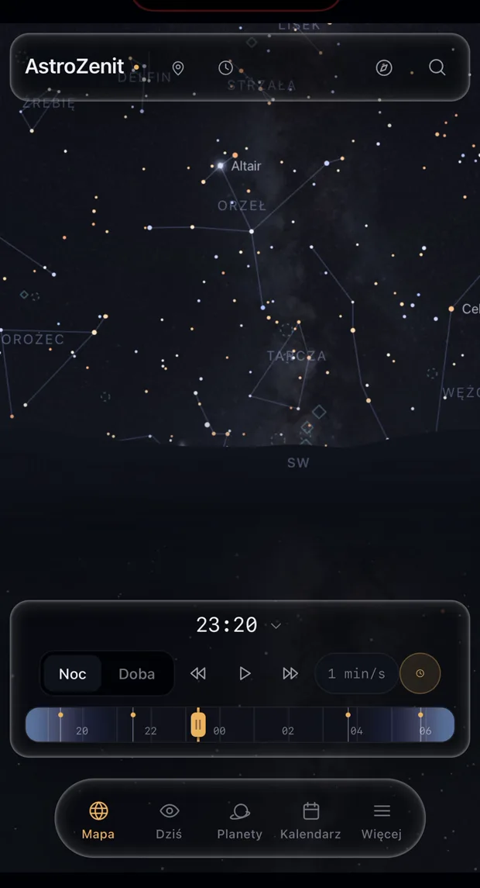
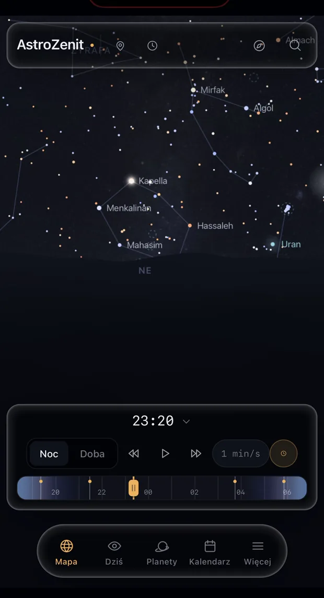

# AstroZenit

Mapa nocnego nieba, która pokazuje, co naprawdę widać z konkretnego miejsca i o konkretnej
porze. Nie jest to ilustracja ani animacja: każde położenie jest liczone z modeli ruchu
ciał niebieskich w chwili, w której patrzysz na ekran.

<p align="center">
  
  
</p>

## Co potrafi

**Mapa nieba.** 8920 gwiazd do jasności 6.5, czyli granicy widoczności okiem nieuzbrojonym
w ciemnym miejscu. 88 gwiazdozbiorów z liniami i granicami, 26 asteryzmów, 110 obiektów
Messiera, Droga Mleczna. Przesuwanie palcem z wybiegiem, przybliżanie zakotwiczone
w kursorze, wskazanie obiektu otwiera jego kartę.

**Celowanie telefonem.** Skierowanie urządzenia w niebo obraca mapę tam, gdzie patrzysz.
Kierunek liczony jest z pełnego obrotu urządzenia, a nie z samych kątów pochylenia, więc
uniesienie telefonu ku zenitowi nie rozhuśtuje obrazu na boki. Poprawkę kompasu magnetycznego
ustawia się przesunięciem palcem i zostaje zapamiętana.

**Planety, Słońce i Księżyc.** Położenie, jasność, odległość, faza, wschód, górowanie
i zachód. Kule planet rysowane z prawdziwych map powierzchni, razem z pierścieniami Saturna
liczonymi z rzeczywistego profilu przezroczystości.

**Kalendarz zjawisk** do 2029 roku: zaćmienia Słońca i Księżyca liczone dla Twojego miejsca,
roje meteorów, opozycje, koniunkcje, maksymalne elongacje, przesilenia i równonoce. Tylko
zjawiska widoczne okiem albo lornetką.

**Satelity.** Przeloty Międzynarodowej Stacji Kosmicznej i innych jasnych obiektów, liczone
modelem SGP4 z aktualnych danych orbitalnych.

**Warunki obserwacyjne.** Okno ciemności astronomicznej, faza i położenie Księżyca, ocena
widoczności każdego obiektu. Prognoza zachmurzenia z mapą regionu, żeby dało się odpowiedzieć
na pytanie, w którą stronę jechać po czystsze niebo.

**Aktualności** z NASA i AstroNETu, odświeżane raz na dobę, z tłumaczeniem tekstów NASA
na polski.

## Jak to liczy

Wszystko dzieje się w przeglądarce. Nie ma tu serwera, który cokolwiek wylicza: katalog
gwiazd i modele ruchu ciał niebieskich lądują na Twoim urządzeniu i tam wykonują całą pracę.

Ma to trzy skutki. Aplikacja działa bez połączenia z siecią, jeżeli tylko raz się wczytała.
Twoje położenie i to, na co patrzysz, nigdzie nie wyjeżdżają. I nie ma czego skalować,
bo koszt obliczeń ponosi urządzenie, a nie serwis.

Położenia pochodzą z biblioteki `astronomy-engine`, opartej na modelach VSOP87 dla planet
i ELP2000 dla Księżyca. Dokładność wystarcza z zapasem do obserwacji okiem, lornetką
i amatorskim teleskopem.

## Źródła danych

| Źródło | Co daje | Licencja |
| --- | --- | --- |
| [astronomy-engine](https://github.com/cosinekitty/astronomy) | położenia ciał, wschody i zachody, fazy, zaćmienia, elongacje | MIT |
| [HYG Database v41](https://github.com/astronexus/HYG-Database) | katalog 8920 gwiazd: położenia, jasności, odległości, typy widmowe | CC BY-SA 4.0 |
| [d3-celestial](https://github.com/ofrohn/d3-celestial) | linie i granice gwiazdozbiorów, katalog Messiera | BSD-3 |
| [Open-Meteo](https://open-meteo.com/) | prognoza pogody i zachmurzenia | CC BY 4.0 |
| [OpenStreetMap](https://www.openstreetmap.org/) | kafelki mapy regionu w sekcji Chmury | ODbL |
| [Celestrak](https://celestrak.org/) | dane orbitalne satelitów | publicznie dostępne |
| [NASA](https://science.nasa.gov/) | teksty i zdjęcia w aktualnościach, mapy powierzchni planet | dobro publiczne, z wyjątkami |
| [Wikimedia Commons](https://commons.wikimedia.org/) | 121 zdjęć obiektów, każde ze sprawdzoną licencją | CC0, CC BY, CC BY-SA |

Zdjęcia NASA nie są objęte jedną licencją i to jest pułapka, w którą łatwo wpaść: agencja
publikuje także prace astrofotografów na własnej licencji, których dalej rozpowszechniać
nie wolno. Skrypt pobierający rozpoznaje je po adnotacji w nazwie pliku i odrzuca.
Zdjęcia z Wikimedia Commons przechodzą kontrolę licencji przy pobieraniu, a autor i licencja
są pokazywane przy każdym obrazie.

Polskie nazwy gwiazdozbiorów, gwiazd i obiektów, opisy oraz dane rojów meteorów są własne.

## Technologia

Vite, React 19, TypeScript. Mapa nieba rysowana na płótnie 2D, bez WebGL: przy kilku
tysiącach gwiazd w kadrze płótno z buforowaniem poświat i grupowaniem po barwach trzyma
60 klatek na sekundę, a daje pełną kontrolę nad wyglądem.

Bez frameworka do stylów i bez biblioteki animacji. Style w modułach CSS, ruch na
przejściach i animacjach CSS.

Stan poza drzewem Reacta, w `zustand`, więc przesuwanie mapy nie przerysowuje ani jednego
komponentu. Pętla klatek pomija rysowanie, gdy nic się nie zmieniło: przy nieruchomym
niebie zamiast sześćdziesięciu obrazów na sekundę powstaje jeden na dwie sekundy, co przy
obserwacji w terenie na baterii ma znaczenie.

## Uruchomienie

```bash
npm install
npm run dev
```

Aplikacja stanie na porcie 5174.

Czujnik orientacji działa wyłącznie przez połączenie szyfrowane, więc do sprawdzenia
celowania telefonem:

```bash
npm run dev:https
```

## Polecenia

| Polecenie | Do czego |
| --- | --- |
| `npm run dev` | serwer deweloperski |
| `npm run build` | wersja produkcyjna do katalogu `dist` |
| `npm run verify` | kontrola obliczeń astronomicznych i przeliczeń kompasu |
| `npm run fetch:news` | pobranie i tłumaczenie aktualności |
| `npm run build:catalog` | przetworzenie katalogu gwiazd ze źródeł |
| `npm run build:satellites` | pobranie danych orbitalnych |
| `npm run build:photos` | pobranie zdjęć obiektów ze sprawdzeniem licencji |

`npm run verify` liczy wschody i zachody Słońca, fazy Księżyca, przesilenia i przeliczenia
czujnika orientacji, i porównuje je z wartościami odniesienia. Rozbieżność większa niż
minuta jest błędem.

## Wdrożenie

Aplikacja jest stroną statyczną, więc może stać na dowolnym hostingu plików.
Konta użytkowników wymagają zaplecza i można je podpiąć na trzy sposoby, opisane
w [docs/start-za-darmo.md](docs/start-za-darmo.md).

| Dokument | O czym |
| --- | --- |
| [docs/start-za-darmo.md](docs/start-za-darmo.md) | od zera do działającej strony z kontami, na planach bezpłatnych |
| [docs/wdrozenie.md](docs/wdrozenie.md) | architektura wdrożenia i decyzje |
| [docs/baza-mysql.md](docs/baza-mysql.md) | własne zaplecze w PHP na hostingu z MySQL |
| [server/README.md](server/README.md) | wymagania i obowiązki przy prowadzeniu kont użytkowników |

## Prywatność

Serwis nie ma analityki, nie ma reklam, nie ma śledzenia i nie profiluje zachowań.
Cztery połączenia wychodzą na zewnątrz i każde odpowiada konkretnej funkcji: prognoza
pogody, kafelki mapy, zdjęcia w aktualnościach i dane orbitalne satelitów. Współrzędne
wysyłane do serwisu pogodowego są przycinane do około kilometra, bo prognoza i tak jest
liczona w siatce kilkunastokilometrowej, a dokładniejsze położenie wskazywałoby budynek.

Pełna treść w aplikacji, pod `#/prywatnosc` i `#/regulamin`.

## Autor

Piotr Banach. Projekt studencki, prowadzony po godzinach.
